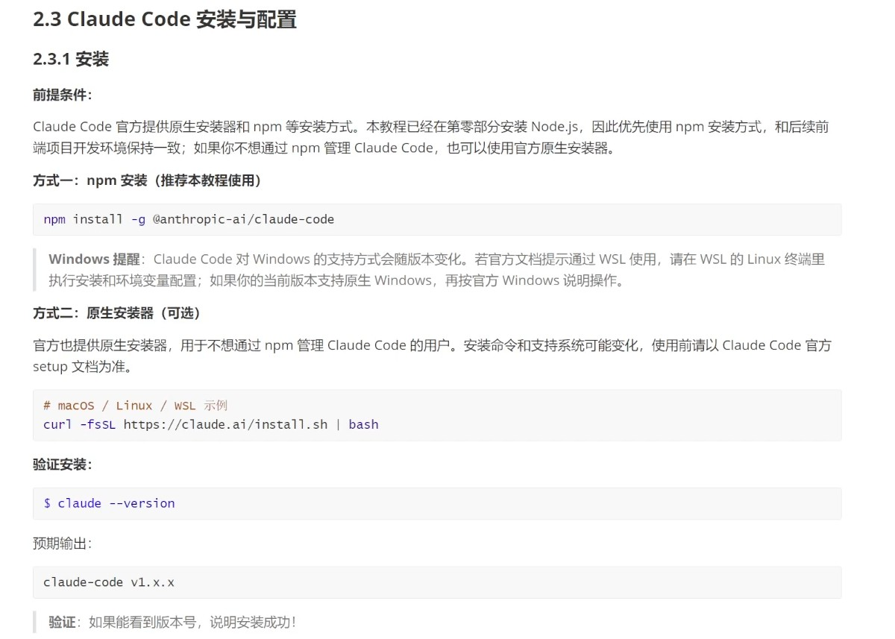
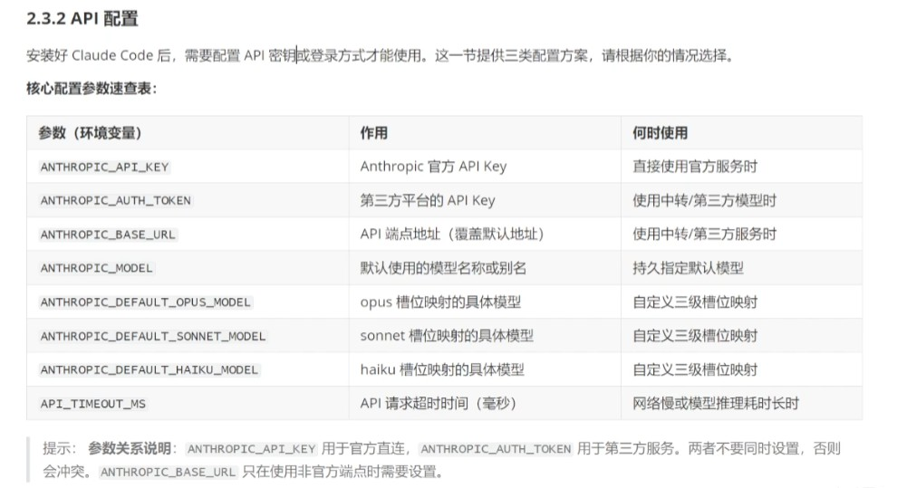
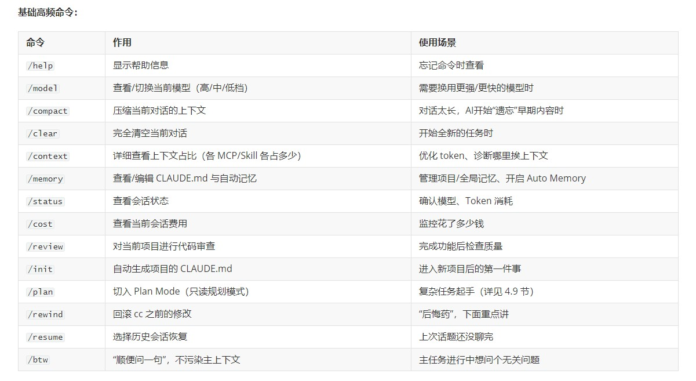
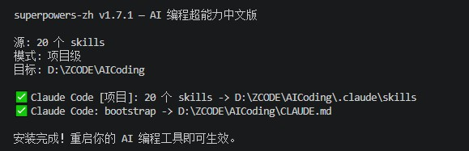
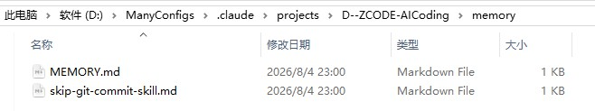
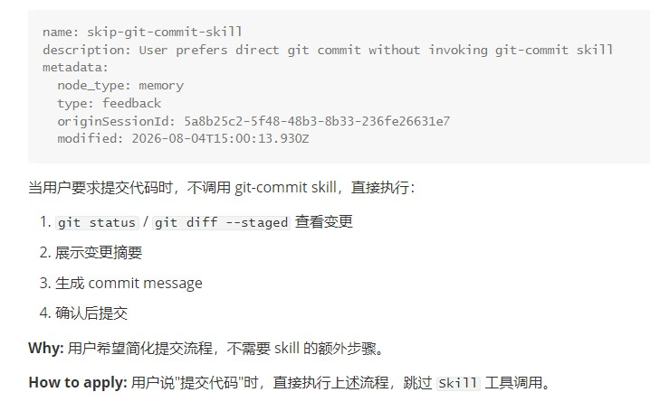

## Claude-Code 使用说明

### 1. claude-code 安装

安装方法：

<br/>

也可以直接使用 VS Code 插件，扩展名：`Claude Code for VS Code`

关键配置（settings.json）：

<br/>

配置文件：
> 顺便说一句：配置模型可以使用 `cc-switch`，配置多个模型时，切换很方便，官网：https://ccswitch.io/zh/

```json
// ~/.claude/settings.json
{
  "env": {
   "ANTHROPIC_BASE_URL": "https://api.deepseek.com/anthropic",
   "ANTHROPIC_AUTH_TOKEN": "<你的 DeepSeek API Key>",
   "ANTHROPIC_MODEL": "deepseek-v4-pro[1m]",
   "ANTHROPIC_DEFAULT_OPUS_MODEL": "deepseek-v4-pro[1m]",
   "ANTHROPIC_DEFAULT_SONNET_MODEL": "deepseek-v4-pro[1m]",
   "ANTHROPIC_DEFAULT_HAIKU_MODEL": "deepseek-v4-flash",
   "CLAUDE_CODE_SUBAGENT_MODEL": "deepseek-v4-flash",
   "CLAUDE_CODE_EFFORT_LEVEL": "max"
  }
}
```

全局项目说明书 ~/.claude/CLAUDE.md 文件内容参考：

```
# 沟通方式
- 默认中文回复，代码、命令、变量名、文件路径保持英文
- 结论先行，简洁直接，不先铺垫背景
- 不谄媚，不夸"这是个很好的问题"，不以"当然可以"开头
- 给真实判断，方案有问题直接指出，发现更好做法主动说明

# Git
- 不自动 `git commit` 或 `git push`，除非我明确要求
- 提交前先展示将要提交的变更摘要
- commit message 使用简洁英文

# 红线操作
以下操作即使在 auto-accept 模式下也必须先问我：
- 删除文件、目录或 git 历史
- 修改 `.env`、密钥、token、证书、CI/CD 配置
- `git push`、`git rebase`、`git reset --hard`、强制推送
- 公开发布（`npm publish`、生产部署等）
```

#### 1.1 修改配置文件目录

claude-code 的配置文件，默认情况下在：`~/.claude`（Mac、Linux）或 `C:\Users\[用户名]\.claude`（Window）

在 Window 环境，如果担心各种文件占空间，想修改配置文件目录，可以通过环境变量 `CLAUDE_CONFIG_DIR` 控制

例如，把环境变量 `CLAUDE_CONFIG_DIR` 修改为 `D:\ManyConfigs\.claude`，重启 claude-code，这时它就会读取这个环境变量对应的配置文件目录了

注意，如果使用了 `cc-switch`，也需要同步更改，在 `设置=>高级=>配置文件目录` 下修改配置存储路径

### 2. 重要指令

<br/>

### 3. 自定义斜杆命令

1. 在 .claude 内新建 commands 文件夹
2. 建立指令文件，例如：date.md
3. 在 date.md 文件内写入要执行的操作即可
4. 直接 /date 就可以使用

### 4. skills

Anthropic 官方 Skill 库：https://github.com/anthropics/skills
Vercel 官方 Skill 库：https://github.com/vercel-labs/agent-skills

这里用的 CLI 工具 `skills` 是 npm 包 skills 的命令，仓库地址：https://github.com/vercel-labs/skills ，也是 Vercel 出品的

安装方法：
```sh
# 安装 Anthropic 官方全部 Skill（ -g 代表安装到用户目录，不写的话则可以安装到项目目录）
# 即使 claude-code 的配置文件目录被修改了，也不用担心，skills 会自动找到的
$ npx skills add anthropics/skills -g

# 只安装指定 Skill（推荐按需安装）
$ npx skills add anthropics/skills@frontend-design -g
$ npx skills add anthropics/skills@mcp-builder -g
$ npx skills add anthropics/skills@skill-creator -g

# 安装整个 Vercel 官方技能库
npx skills add vercel-labs/agent-skills -g

# 只单独安装 React 最佳实践（推荐）
npx skills add vercel-labs/agent-skills --skill vercel-react-best-practices -g

# 可以用 --list 查看支持的技能列表
npx skills add vercel-labs/agent-skills --list
```

注意：
默认情况下，只会安装到通用文件夹 `.agents/` 内，但是这样 claude-code 读取不了，
claude-code 只会识别 `.claude/skills` 里面的内容，有两种方式解决：

1、默认的安装过程中，会有选项可以选择 claude-code，这里要仔细看操作说明，
它是可以多选的，需要按 `空格` 键选中，最后按 `Enter` 键确认，直接按 Enter 相当于啥也没选。。

2、安装时添加参数 `--agent claude-code`，这样就只会安装成 claude-code 适用的方式，例如：

```sh
npx skills add anthropics/skills@frontend-design --agent claude-code -g
# --agent 可以缩写为 -a
npx skills add anthropics/skills@frontend-design -a claude-code -g
```

其它命令：

```sh
# 查看帮助，可以看到很多使用示例
npx skills --help

# 在项目里面安装 skills 时，会携带有一个 skills-lock.json 的文件
# 可以使用以下命令恢复 skills，类似 npm i 功能
# 但是这个是个实验性功能，做的不完善
# 使用这个命令只能恢复到 .agents/ 文件夹，无法恢复到 .claude/ 文件夹内
# 后续更新后，也许可以支持，先留个痕！
npx skills experimental_install
```

#### 4.1 commands 和 skills 的区别

`commands`：内容简单，纯 MD 文件，固定流程的快捷指令，手动调用
`skills`：内容复杂，可包含多个文件夹和文件，可复用的方法论，模型自动调用（当任务符合某个 skill 的适用场景时）

最大的区别就是：`commands 只能自己手动调用，而 skills 是可以自动被调用的`

通过 `/xxx` 方式是 skill 的调用方式，但 Claude Code 把两者统一暴露为可调用的 skill 项了，所以也能通过 skill 工具调用 command

#### 4.2 Superpowers 的使用

Superpowers 本质是一套工作方法论集合

安装前后对比：

| 没装 Superpowers                      | 装了 Superpowers                                             |
| ------------------------------------- | ------------------------------------------------------------ |
| 你：“加个批量导出功能”                | 你：“加个批量导出功能”                                       |
| AI：“好的，我来实现...”（直接写代码） | AI：“在开始前我需要确认：1.导出格式？2.数据量多大？3.需要异步吗？”→给出 2-3 个方案，确认后再动手 |

核心 Skills 一览：

| Skill                      | 功能                              | 触发时机            |
| -------------------------- | --------------------------------- | ------------------- |
| 头脑风暴 (brainstorming)   | 需求分析→设计规格，先想清楚再动手 | 新需求/新功能开始时 |
| 编写计划 (writing-plans)   | 把规格拆成可执行的实施步骤        | 确认设计后          |
| 执行计划 (executing-plans) | 按计划逐步实施，每步验证          | 开发过程中          |
| 测试驱动开发 (TDD)         | 严格 TDD：先写测试，再写代码      | 开发核心逻辑时      |
| 系统化调试 (debugging)     | 四阶段调试法：定位→分析→假设→修复 | 遇到 Bug 时         |
| 代码审查 (code-review)     | 派遣审查 agent 检查代码质量       | 功能完成后          |
| 完成前验证 (verification)  | 声称完成前必须跑验证              | 任务结束前          |

安装方法：

```sh
# 英文版（原版）
npx superpowers

# 中文增强版（推荐安装这个，包含 6 个中国特色 Skill）
npx superpowers-zh
```

安装成功图示（增加若干 skills 并且在 CLAUDE.md 增加内容）：

<br/>

### 5. MCP

MCP 是 Anthropic 推出的一个标准化协议，让 AI 工具可以连接外部服务和数据源，可以把 MCP 理解为给 AI 装 "插件" 或 "扩展能力"

**claude-code 内置的 MCP 能力：**
GitHub MCP Server → 操作 GitHub（创建PR、管理Issue）
Database MCP Server → 直接查询数据库
Browser MCP Server → 浏览器自动化测试

**MCP 与 Skill 的关系：**

- **Skill** 定义了 "做什么、怎么做"（流程和规范）
- **MCP** 提供了 "能力扩展"（让AI能做更多事情）

两者互补：可以在 Skill 中调用 MCP 提供的能力。例如，一个用于部署检查的 skill 可以调用 GitHub MCP 来创建 PR

#### 5.1 添加 MCP 服务

例如有以下 MCP 服务：

```json
{
  "mcpServers": {
    "fetch": {
      "type": "streamable_http",
      "url": "https://mcp.api-inference.modelscope.net/xxxxxxxxxxxxxx/mcp"
    }
  }
}
```

有两种添加方式：

① 使用命令行：

```sh
# local（默认），会写在 ~/.claude.json 项目分区里
claude mcp add --transport http fetch https://mcp.api-inference.modelscope.net/xxxxxxxxxxxxxx/mcp

# user（全局），全项目通用，会写在 ~/.claude.json 全局节点
claude mcp add --scope user --transport http fetch https://mcp.api-inference.modelscope.net/xxxxxxxxxxxxxx/mcp

# 如果需要鉴权（Bearer Token）
claude mcp add --transport http fetch https://mcp.api-inference.modelscope.net/xxxxxxxxxxxxxx/mcp --header "Authorization: Bearer your-token"
```

② 在项目根目录创建 `.mcp.json` 文件（将此文件加入到 .gitignore，不要暴露服务的 url 链接）：

直接把上面的 json 代码复制进去，将 type 字段由 `streamable_http` 改为 `http` 即可

注：无论哪种方式，记得重启 claude-code，重新加载！

**其它 MCP 命令：**

```sh
# 支持的 mcp 服务列表
claude mcp list
# 删除 mcp
claude mcp remove fetch
# 更多。。
claude mcp --help
```

### 6. hooks

可以让 claude-code 在执行某一特定的操作前后，做一些指定的事情

例如：每次修改代码后，格式化代码

```json
"PostToolUse": [{
  "matcher": "Write",
  "hooks": [{
    "type": "command",
    "command": "npx prettier --write $CLAUDE_FILE_PATH"
  }]
}]
```

例如：禁止修改某些文件（PreToolUse 拦截）

```json
"PreToolUse": [{
  "matcher": "Write",
  "hooks": [{
    "type": "command",
    "command": "echo $CLAUDE_FILE_PATH | grep -q 'package-lock.json' && exit 1 || exit 0"
  }]
}]
```

### 7. memory

每当你说类似：请记住。。、从现在开始你。。、我只用。。等等类似的话时，
AI 有可能会把这条信息存到持久化记忆中，以后的对话都会自动读取

例如：

```
我：从现在开始，如果我让你提交代码，你就遵循你自己的那一套做法，不需要遵循 git-commit skill 的规范，记住了吗？
AI：明白。就是直接检查 git 状态、展示变更、生成 commit message、确认后提交，不走 Skill 工具调用流程。我把这个记下来。
```

这时，AI 会把这个事记下来，存到某个 memory 文件夹内，如图：

<br/>

- `MEMORY.md` — 索引文件
- `skip-git-commit-skill.md` — 记录你的偏好

文件内容如下：

`MEMORY.md`：

<br/>

`skip-git-commit-skill.md`：

<br/>

这样子一来，以后的对话都能记住你这个偏好

**规则优先级：**

用户显式指令 > memory > `CLAUDE.md` 默认规则（包括 skills 匹配）

### 15. 关于模型使用

1. **Deepseek**
- 优点：支持 webSearch、webFetch
  - 但是 webFetch 不可用，WebFetch 内部有两步必须要连接 Anthropic 自己的服务：域名安全校验 + 网页抓取代理。这两步必须和 claude.ai 通信，会被墙，实测配置代理也没用
- 缺点：不支持多模态，只能文字交流

2. **MIMO**
- 优点：支持多模态，可以看图
- 缺点：不支持 webSearch、webFeatch，不可以看视频

10. **不支持 webSearch 怎么办？**
- Bash 调用 curl 或其他命令行工具的方式
- 安装 MCP Search 服务

11. **不支持 webFetch 怎么办？**
- Bash 调用 curl 或其他命令行工具的方式
- 安装 MCP Fetch 服务
