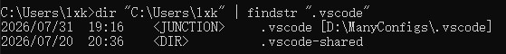

#### 1. 迁移 vscode 的配置目录

vscode 相关的目录主要有两个，但是都在 C 盘：

- 全局用户配置目录：`C:\Users\[用户名]\.vscode`，这里面主要就是安装的扩展，比较占空间
- 用户数据目录：`AppData/Roaming/Code`，包含用户配置、缓存、界面状态

有两种解决方式：

##### ① 修改环境变量

Windows 系统环境变量：

- `VSCODE_EXTENSIONS` → 指定扩展目录（对应 .vscode/extensions，这个只指定扩展目录，不能指定整个 .vscode 目录）
    - 例如将其设置成：`D:\ManyConfigs\.vscode\extensions`
- `VSCODE_USER_DATA` → 指定用户数据目录（AppData/Roaming/Code）
    - 例如将其设置成：`D:\ManyConfigs\.vscode\Code`

##### ② 符号链接（软链接，透明迁移，mklink，类似 linux 的 ln 命令）

将 `.vscode` 剪切到 D 盘 `D:\ManyConfigs\.vscode`

以管理员打开 CMD（只能用 CMD，用 powershell 不行），执行：

`mklink /J "C:\Users\用户名\.vscode" "D:\ManyConfigs\.vscode"`（`/J` 是目录联结，简单稳定）

执行后，会在 C 盘生成 `.vscode` 文件夹，除了文件夹图标上带有快捷方式图案，其它就和正常的文件夹一模一样，也不会显示是快捷方式（本来就不是），
系统访问 C 盘路径时，自动重定向到 D 盘，vscode 无感知

后续可以通过 `dir "C:\Users\用户名" | findstr ".vscode"` 查看文件夹类型，如图：

追求方便则直接输入：`dir %USERPROFILE%` 即可展示用户目录内的所有文件和文件夹（记得要用 CMD，powershell 不行，上面的命令也是一样）

注意：后面如果要删除生成的文件夹 `C:\Users\用户名\.vscode`，最好不要直接用右键删除，要使用命令行 `rmdir "C:\Users\用户名\.vscode"` 操作，
因为少数 Windows 版本资源管理器处理 Junction 存在 bug，有可能递归删除 D 盘里面对应的所有文件！

理论上来说，很多文件夹都可以用这种方式迁移，不确定的，使用之前可以先问下 AI
